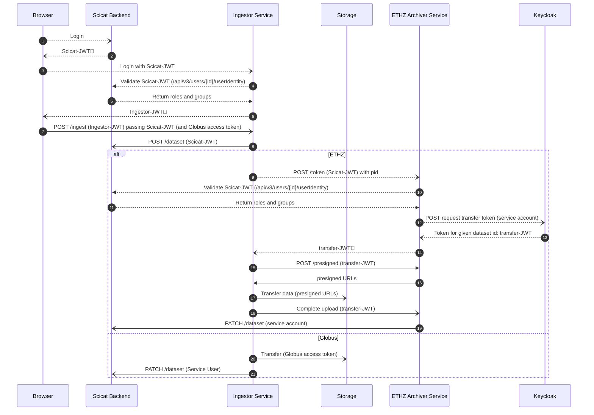
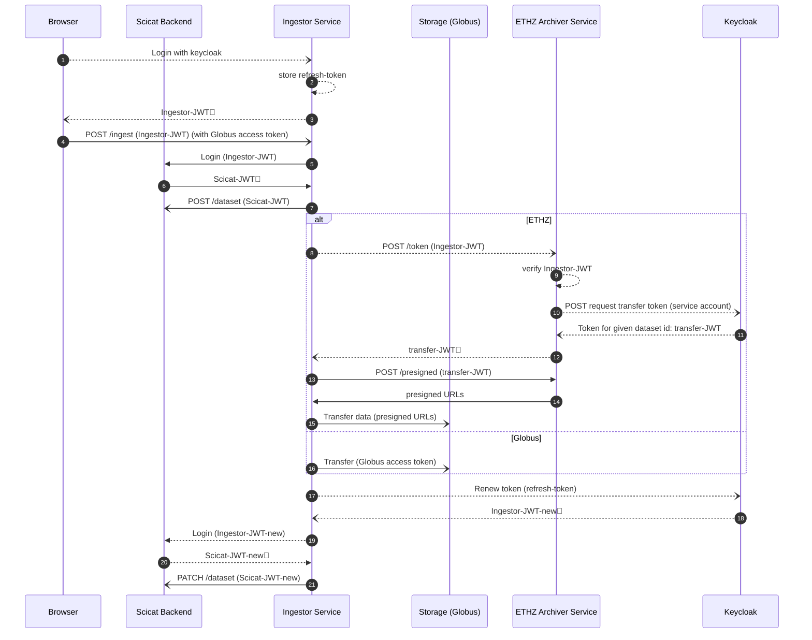

# Authentication Flows

Requests related to authentication are dotted lines, while other API calls are solid
lines.

## Option A: Validate Scicat identity

- Both the ingestor and archiver accept scicat tokens during logon.
- The ingestor/archiver validates the scicat token using a `/userinfo` endpoint and
  check the returned payload for authorization claims.
- Requires a scicat service user for the ingestor for the dataset update for globus.
  ETHZ can avoid this by re-using the archiver service user (via an api)

### Changes needed

- (scicat backend) Add authorization claims to `/userinfo`

## Option B

- The user doesn't pass the Scicat-JWT to the ingestor at any time. Instead, the
  ingestor can directly exchange the Ingestor-JWT (which is issued by keycloak and
  contains all needed claims) for a scicat token.
- Ingestor tokens are issued with a refresh_token, allowing them to be renewed after the
  data transfer is complete

## Changes

- Accept Ingestor-JWT as a valid login method. This may require token exchange, since
  scicat and the ingestor have different clientIds
