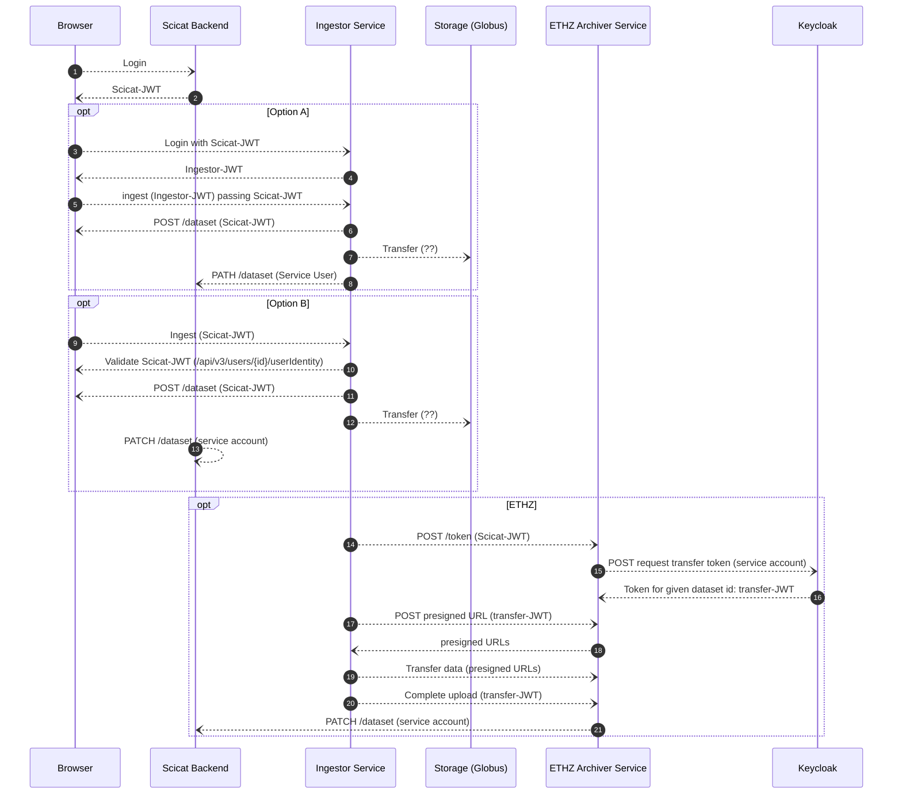

```mermaid
sequenceDiagram
  autonumber
  participant B as Browser 
  participant S as Scicat Backend
  participant I as Ingestor Service
  participant G as Storage (Globus)
  participant A as ETHZ Archiver Service
  participant K as Keycloak

  B --) S: Login
  S --) B: Scicat-JWT 

  opt Option A
    B --) I: Login with Scicat-JWT
    I --) B: Ingestor-JWT
    B --) I: ingest (Ingestor-JWT) passing Scicat-JWT
    I --) B: POST /dataset (Scicat-JWT)
    I --) G: Transfer (??)
    I --) S: PATH /dataset (Service User)
  end

  opt Option B
    B --) I: Ingest (Scicat-JWT)
    I --) B: Validate Scicat-JWT (/api/v3/users/{id}/userIdentity)
    I --) B: POST /dataset (Scicat-JWT)
    I --) G: Transfer (??)
    S --) S: PATCH /dataset (service account)
  end

  opt ETHZ
    I --) A: POST /token (Scicat-JWT)
    A --) K: POST request transfer token (service account)
    K --) A: Token for given dataset id: transfer-JWT
    I --) A: POST presigned URL (transfer-JWT)
    A --) I: presigned URLs
    I --) A: Transfer data (presigned URLs)
    I --) A: Complete upload (transfer-JWT)
    A --) S: PATCH /dataset (service account)
  end

```
