# Authentication Flows

Requests related to authentication are dotted lines, while other API calls are solid
lines.

## Option A: Validate Scicat identity

```mermaid
sequenceDiagram
  autonumber
  participant B as Browser
  participant S as Scicat Backend
  participant I as Ingestor Service
  participant G as Storage
  participant A as ETHZ Archiver Service
  participant K as Keycloak


  B --) S: Login
  S --) B: Scicat-JWT🔑
  B --) I: Login with Scicat-JWT
  I -->> S: Validate Scicat-JWT (/api/v3/users/{id}/userIdentity)
  S -->> I: Return roles and groups
  I --) B: Ingestor-JWT🔑
  B -) I: POST /ingest (Ingestor-JWT) passing Scicat-JWT (and Globus access token)
  I -) S: POST /dataset (Scicat-JWT)

  alt ETHZ
    I --) A: POST /token (Scicat-JWT) with pid
    A -->> S: Validate Scicat-JWT (/api/v3/users/{id}/userIdentity)
    S -->> A: Return roles and groups

    A --) K: POST request transfer token (service account)
    K --) A: Token for given dataset id: transfer-JWT
    A --) I: transfer-JWT🔑

    I ->> A: POST /presigned (transfer-JWT)
    A ->> I: presigned URLs

    I -) G: Transfer data (presigned URLs)
    I -) A: Complete upload (transfer-JWT)
    A -) S: PATCH /dataset (service account)

  else Globus
    I -) G: Transfer (Globus access token)
    I -) S: PATCH /dataset (Service User)
  end

```

- Both the ingestor and archiver accept scicat tokens during logon.
- The ingestor/archiver validates the scicat token using a `/userinfo` endpoint and
  check the returned payload for authorization claims.
- Requires a scicat service user for the ingestor for the dataset update for globus.
  ETHZ can avoid this by re-using the archiver service user (via an api)

### Changes needed

- (scicat backend) Add authorization claims to `/userinfo`

## Option B

- The user doesn't pass the Scicat-JWT to the ingestor at any time. Instead, the
  ingestor can directly exchange the Ingestor-JWT (which is issued by keycloak and
  contains all needed claims) for a scicat token.
- Ingestor tokens are issued with a refresh_token, allowing them to be renewed after the
  data transfer is complete

## Changes

- Accept Ingestor-JWT as a valid login method. This may require token exchange, since
  scicat and the ingestor have different clientIds

## Option C (Proposal Swen)

### Initial thoughts

**Ingestor**

- can run anywhere
- therefore, it cannot contain any secret
- needs to talk to SciCat and Archiver Service API
- needs to be authorised with a user token

**User**

- does not want to log in all the time
- is only interested in starting a job
  - archive data
  - unarchive data
- his authentication token can time out

**SciCat**

- only accepts authenticated requests
- issues its own SciCat tokens (JWT with HS256 algorithm, aka «self signed»)
  - after a user has successfully logged in to Keycloak
- currently only accepts SciCat tokens
- so it acts as an authority instance
- offers a self-made mechanism to check if a SciCat token is valid

**Archiver Service**

- only accepts authenticated requests
- issues Keycloak service tokens (JWT with RS256, public key signed)
- currently only accepts JWT tokens issued and signed by Keycloak

### What needs to be done

- Archiver Service
  - needs to be able to accept SciCat 🔑 as well (see ScopeMArchiver#146)
  - needs to be able to create valid SciCat 🔑 (variant A)
- SciCat
  - can exchange Ingestor JWT 🔑 for Ingestor SciCat 🔑 (variant B)
  - accepts all JWT 🔑 issued and signed by Keycloak (variants C+D)

**Note**: the diagram below does not yet include any authorisation information. It only includes authentication. In future we would like to use JWT 🔑 that contain authorisation information, e.g. tokens for every dataset upload.

```mermaid
sequenceDiagram
  autonumber
  participant B as Browser
  participant S as Scicat Backend
  participant I as Ingestor Service
  participant G as Storage (Globus)
  participant A as ETHZ Archiver Service
  participant K as Keycloak

  B -) S: Access
  S -) K: User Login (redirect)
  K --) S: User JWT🔑
  S ->> S: Exchange User JWT 🔑 for SciCat 🔑
  S --) B: User SciCat 🔑
  B --) I: User SciCat 🔑
  I --) A: User SciCat 🔑
  alt tbd. ScopeMArchiver issue 146
    A -) S: verify + request User info (User SciCat 🔑)
    S -) A: OK + User info
  end
  A -) K: request Ingestor JWT 🔑 (user/pw)
  K --) A: Ingestor JWT 🔑
  A --) I: Ingestor JWT 🔑
  I ->> I: store refresh-token of Ingestor JWT 🔑
  I -) A: request S3 credentials (Ingestor JWT 🔑)
  A --) I: S3 credentials
  I ->> I: upload to S3 ⏳
  I -) A: report S3 upload finished (Ingestor JWT 🔑)

  alt Variant A: Archiver can create Ingestor SciCat 🔑
    A -) S: request Ingestor SciCat 🔑 (secret/Basic Auth)
    S --) A: Ingestor SciCat 🔑
    A --) I: Ingestor SciCat 🔑
    I -) S: report dataset upload finished (Ingestor SciCat 🔑)
  else Variant B: SciCat exchanges Ingestor JWT 🔑 for SciCat 🔑
    I -) S: request Ingestor SciCat 🔑 (Ingestor JWT 🔑)
    S ->> S: Exchange Ingestor JWT 🔑 for SciCat 🔑
    S --) I: Ingestor SciCat 🔑
    I -) S: report dataset upload finished (Ingestor SciCat 🔑)
  else Variant C: SciCat accepts Ingestor JWT 🔑
    I -) S: report archiving finished (Ingestor JWT 🔑)
  else Variant D: Archiver report directly back to SciCat
    A ->> A: store Ingestor JWT 🔑
    A ->> A: wait until upload is finished ⏳
    A -) S: report archiving finshed (Ingestor JWT 🔑)
  end

```

