# Authentication Flows

Requests related to authentication are dotted lines, while other API calls are solid
lines.

## Option A: Validate Scicat identity

```mermaid
sequenceDiagram
  autonumber
  participant B as Browser
  participant S as Scicat Backend
  participant I as Ingestor Service
  participant G as Storage
  participant A as ETHZ Archiver Service
  participant K as Keycloak


  B --) S: Login
  S --) B: Scicat-JWT🔑
  B --) I: Login with Scicat-JWT
  I -->> S: Validate Scicat-JWT (/api/v3/users/{id}/userIdentity)
  S -->> I: Return roles and groups
  I --) B: Ingestor-JWT🔑
  B -) I: POST /ingest (Ingestor-JWT) passing Scicat-JWT (and Globus access token)
  I -) S: POST /dataset (Scicat-JWT)

  alt ETHZ
    I --) A: POST /token (Scicat-JWT) with pid
    A -->> S: Validate Scicat-JWT (/api/v3/users/{id}/userIdentity)
    S -->> A: Return roles and groups

    A --) K: POST request transfer token (service account)
    K --) A: Token for given dataset id: transfer-JWT
    A --) I: transfer-JWT🔑

    I ->> A: POST /presigned (transfer-JWT)
    A ->> I: presigned URLs

    I -) G: Transfer data (presigned URLs)
    I -) A: Complete upload (transfer-JWT)
    A -) S: PATCH /dataset (service account)

  else Globus
    I -) G: Transfer (Globus access token)
    I -) S: PATCH /dataset (Service User)
  end

```

- Both the ingestor and archiver accept scicat tokens during logon.
- The ingestor/archiver validates the scicat token using a `/userinfo` endpoint and
  check the returned payload for authorization claims.
- Requires a scicat service user for the ingestor for the dataset update for globus.
  ETHZ can avoid this by re-using the archiver service user (via an api)

### Changes needed

- (scicat backend) Add authorization claims to `/userinfo`

## Option B

- The user doesn't pass the Scicat-JWT to the ingestor at any time. Instead, the
  ingestor can directly exchange the Ingestor-JWT (which is issued by keycloak and
  contains all needed claims) for a scicat token.
- Ingestor tokens are issued with a refresh_token, allowing them to be renewed after the
  data transfer is complete

## Changes

- Accept Ingestor-JWT as a valid login method. This may require token exchange, since
  scicat and the ingestor have different clientIds

## Option C (Proposal Swen)

### Initial thoughts and running environment

**Ingestor**

- can run _either_ as a
  - central service
  - client application
- if run as a client application:
  - cannot contain any secret (e.g. service account for SciCat)
  - app must be authorised by the user

**User**

- does not want to log in all the time (single sign-on preferred)
- is only interested in _starting_ a job (fire and forget), e.g.
  - archive data
  - unarchive data
- the job itself needs to be able to report when its done, independently of the user

**SciCat**

- only accepts authenticated requests
  - currently only SciCat tokens
  - refresh tokens are not supported
  - Service Accounts
- issues its own SciCat tokens (JWT with HS256 algorithm, aka «self signed»)
  - after a user has successfully logged in to Keycloak
- acts as an authority instance
  - issues SciCat tokens
  - offers a self-made mechanism to check validity of a SciCat token

**ETHZ Archiver Service**

- only accepts authenticated requests
  - JWT RS256 tokens issued and signed by Keycloak
  - JWT HS256 tokens issued by SciCat
- can issue a Ingester token for a valid SciCat token
- has service account for SciCat
- must be able to report the status of a dataset any time to SciCat

### Use-case: User archives data (MinIO S3 Storage)

**Notes**: 

- the diagram below does not include any authorisation information, only authentication.
- In future we would like to use JWT 🔑 that contain authorisation information, e.g. tokens for every dataset upload.
- ETH use-case:
  - Ingestor can run as a service or a client application
    - does not contain any service account
    - exchanges the User SciCat 🔑 to a Ingestor 🔑 when starting upload (fire and forget)
  - use of MinIO S3 instead of Globus for upload 
  - ETHZ Archiver Service has service accounts for:
     - **S3** to get pre-signed URLs for data upload
     - **SciCat** to report upload finish and schedule dataset archival
- PSI use-case:
  - a) Ingestor is run as a service
    - Ingestor can contain a service account
    - Ingestor can report back to SciCat
  - b) Ingestor is run as a client application
    - Ingestor _cannot_ contain a service account
    - Ingestor _cannot_ report back to SciCat
    - instead, PSI needs to implement something similar like the ETHZ Archiver Service

